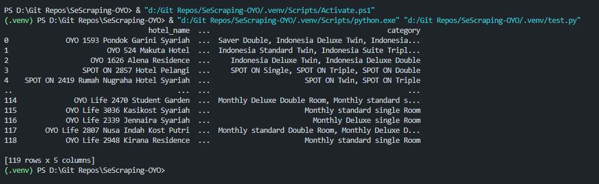
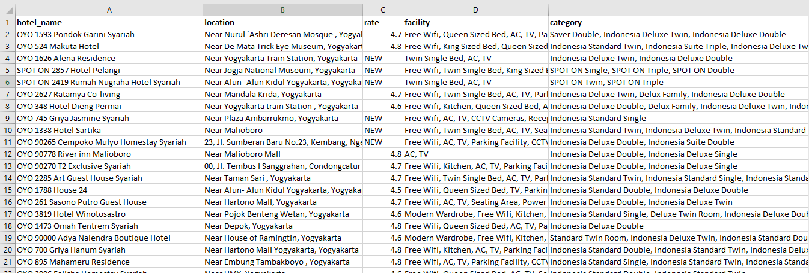

# Auto Web Scraping: OYO Rooms
*Source: https://www.oyorooms.com/id/hotels-in-yogyakarta/*

## About Project
In this project, I use Selenium to scrape/extract the info of hotels located in **Yogyakarta region, Indonesia**. There were 119 hotels where the information was extracted using this automation script. The extracted information is about:
- Hotel name: name of hotel listed on the website
- Location: location of the hotel
- Rate: rating of the hotel, ranging from 1.0 to 5.0
- Facility: facility offered by the hotel
- Category: category/type of room offered by the hotel

## Python Packages
- webdriver-manager
- selenium
- pandas

## Processes
Broadly speaking, the following process occurs when the script (scrapeOyo.py) is executed.

## Result
Below is the result as dataframe.

Below is the result after saving as CSV.

